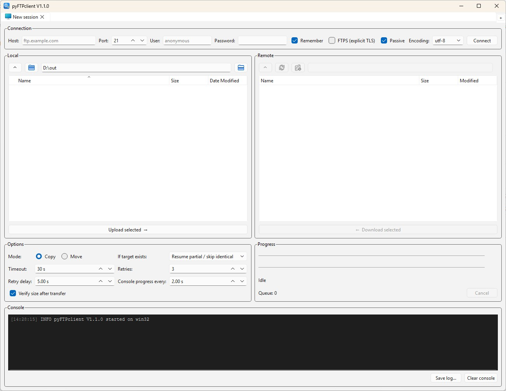

# pyFTPclient
A cross-platform (Windows + Linux) GUI FTP/FTPS client built with PySide6. Features:
- **tabs**: every tab is an independent session (own connection, local + remote browsers, options, transfer queue,
  progress and console), so transfers can run **in parallel**, to the same or to different servers
  - `+` button / `Ctrl+T` duplicates the current tab (same server, folders and options, auto-connects)
  - right-click a tab to rename it, open an empty tab or close it; `Ctrl+W` closes the current tab
  - the tab title shows the progress of the running transfer
- side-by-side local and remote browsers; files **and** folders (multi-select) can be transferred by:
  - drag & drop between the two browsers (drop onto a folder to target it), or from the OS file manager
  - the `Upload selected` / `Download selected` buttons, or the right-click menus
- remote file management: new folder, rename, delete (recursive)
- **copy** or **move** (the source is deleted only after a verified successful transfer; emptied folders are cleaned up)
- configurable **timeout**, **number of retries** and **retry delay**
- automatic reconnect and **resume** (REST) of partial files on retry
- policy for existing targets: resume partial / skip identical, overwrite, or skip
- optional size verification after each file
- per-tab transfer queue (new transfers wait for the current one in the same tab)
- console-like log with colored messages, periodic **progress, speed and ETA** lines, save-to-file
- file and total progress bars with live speed / ETA / elapsed time
- explicit FTPS (TLS) and active / passive mode support, selectable filename encoding
- all tabs are persisted in `settings.json` (password only if "Remember" is checked; stored in plain text)

# Usage
- [end-user] Can be used via the bundled executable (available in Releases)
- [end-user] Windows: run `Install.bat` and after that `START_FTPclient.bat`
- [end-user] Linux: run `./Install.sh` and after that `./START_FTPclient.sh`
  - on Debian/Ubuntu Qt may need `sudo apt install libxcb-cursor0 libegl1`
- [dev] Can be built as an executable by running the install script and after that `BUILD_release.bat` / `./BUILD_release.sh`
